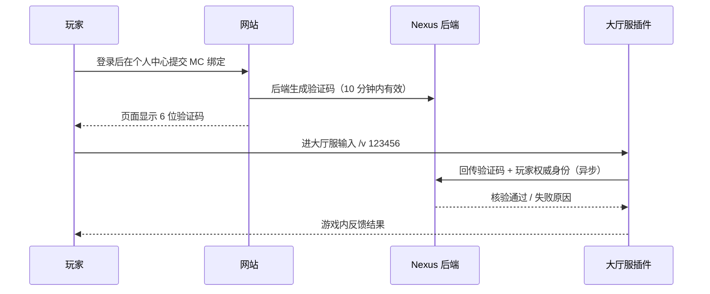

# NexusPermit 插件文档（Luminol Nexus MC 绑定核验）

> 适用对象：服务器管理员 / 运维
> 目标平台：Paper 1.20.6（Java 21），部署于**大厅服务器**
> 配套系统：Luminol Nexus 网站 + 后端（Cloudflare Workers）

---

## 1. 插件简介

NexusPermit 部署在大厅服务器上，负责完成「网站发起的 MC 账号绑定」的最后一步核验，并在玩家进服时反查绑定状态做提示。

**它做什么**：

- 玩家在网站提交 MC 绑定后获得一个 6 位验证码（有效期 10 分钟），玩家在大厅输入 `/v <验证码>`，插件把验证码与该玩家的权威身份回传后端完成核验
- 玩家进服时，插件自动反查该角色名的绑定状态，给出已绑定 / 未绑定的提示

**它不做什么**：

- 不参与网站登录、绑定发起、验证码展示（这些都在网站上完成）
- 不做头像推送与皮肤查询

## 2. 绑定流程总览



要点：

- 插件回传的玩家身份一律取自服务端 `Player` 对象（角色名 + UUID 标准格式），**玩家无法通过聊天输入伪造身份**
- 验证码是一次性凭据：核验成功立即作废；输错次数过多会作废；超时后失效
- 并发安全：每个验证码只属于一个绑定会话，多人同时输入互不影响；拿别人的码输入会触发身份不一致保护

## 3. 功能与命令

### 3.1 `/v` 验证码核验

用法：`/v <验证码>`（验证码 4–12 字符，当前为 6 位数字）

仅在线玩家可用，控制台执行无效。核验结果以游戏内消息反馈：

| 结果             | 游戏内文案                                 | 说明                                 |
| ---------------- | ------------------------------------------ | ------------------------------------ |
| 核验成功         | 绑定成功！                                 | 绑定落库，网站侧立即生效             |
| 验证码无效或过期 | 验证码无效或已过期，请回网站重新获取       | 不存在 / 过期 / 已被使用             |
| 尝试次数超限     | 尝试次数过多，请回网站重新发起绑定         | 输错次数过多，验证码作废             |
| 玩家不一致       | 当前玩家与发起绑定的账号不一致             | 网站提交的身份与进服核验的玩家对不上 |
| 已被他人绑定     | 该游戏账号已被其他网站用户绑定             | 验证码等待期间账号被他人核验         |
| 冷却中           | 操作过于频繁，请 N 秒后再试                | 同一玩家连续输入 /v 的插件本地冷却   |
| 网络异常         | 网络异常，请稍后再试 /v <验证码>           | 验证码未被消费，可安全重试           |
| 服务不可用       | 绑定服务暂时不可用（状态码），请联系管理员 | 含 429 限流（会提示可重试时间）      |

### 3.2 进服反查绑定

玩家进服时插件自动（异步）查询其绑定状态并私发提示：

| 查询结果     | 玩家收到的提示                                                                                 |
| ------------ | ---------------------------------------------------------------------------------------------- |
| 已绑定并核验 | 欢迎回来，你的账号已完成绑定                                                                   |
| 已绑定未核验 | 你的账号已绑定但尚未完成核验：请回网站获取验证码，在大厅输入 /v <验证码>                       |
| 未绑定       | 你的 MC 账号还未绑定网站账号：请到网站个人中心绑定 MC 账号，获取验证码后在大厅输入 /v <验证码> |
| 查询失败     | （无提示，静默降级，仅服务端日志记录）                                                         |

## 4. 安装与部署

### 4.1 环境要求

| 项目     | 要求                                |
| -------- | ----------------------------------- |
| 服务端   | Paper 1.20.6（大厅服务器）          |
| Java     | 21（Paper 1.20.6 本身要求 Java 21） |
| 网络     | 大厅服必须能访问 Nexus 后端地址     |
| 传输安全 | 生产环境后端地址必须为 HTTPS        |

### 4.2 安装步骤

1. 从本仓库 Releases 获取 `NexusPermit-<版本>.jar`（或按第 5 节自行构建）
2. 放入大厅服 `plugins/` 目录
3. 首次启动后会在 `plugins/NexusPermit/` 生成默认 `config.yml`
4. 向 Nexus 后端管理员索取两项信息并填入配置：
   - `api-base-url`：后端服务地址
   - `webhook-secret`：服务端间共享密钥
5. 重启服务器使配置生效

### 4.3 配置文件说明

`plugins/NexusPermit/config.yml`：

```yaml
# 后端地址与 Secret 均从 Nexus 后端管理员处获取
api-base-url: "https://api.example.com"
webhook-secret: "从后端管理员处获取"
```

| 配置项           | 说明                                                                     |
| ---------------- | ------------------------------------------------------------------------ |
| `api-base-url`   | Nexus 后端地址；本地开发默认 `http://localhost:8787`，**生产必须 HTTPS** |
| `webhook-secret` | 服务端间共享密钥；留空时插件启动会告警，所有请求将被后端 403 拒绝        |

> **Secret 安全须知**：这是服务端凭据，等同于后端大门钥匙。只存放在服务器配置文件中并收紧文件权限；不要提交到任何仓库、不要外发；泄露或怀疑泄露时立即联系后端管理员轮换。

## 5. 构建方法（面向开发者）

```bash
# 环境要求：JDK 21
./gradlew build
# 产物：build/libs/NexusPermit-<版本>.jar
```

- 依赖仅使用 JDK 内置 `java.net.http.HttpClient` 与 Paper 运行时自带的 Gson，无第三方库
- 本地起一个 1.20.6 测试服：`./gradlew runServer`（首次需接受 EULA）

## 6. 安全设计说明

- **身份权威**：核验身份只取自服务端 Player 对象，杜绝聊天栏伪造
- **凭据不落盘**：验证码与 Secret 不会写入任何日志或崩溃报告（验证码是一次性凭据，落日志有被抢核验风险）
- **线程模型**：所有 HTTP 在异步线程执行，结果回主线程后才操作 Bukkit API，不卡主线程
- **超时与重试**：连接/请求超时可配置（默认 5s/10s）；网络层失败可安全重试；收到响应不会盲目重试；触发限流时按后端给出的时间提示玩家
- **响应健壮性**：对所有响应做安全解析与异常兜底，畸形响应不会导致插件崩溃或刷屏

## 7. 常见问题（FAQ）

| 现象                                  | 可能原因与处理                                                             |
| ------------------------------------- | -------------------------------------------------------------------------- |
| 启动日志出现「webhook-secret 未配置」 | 未填 Secret，所有核验请求会被 403 拒绝；按 4.3 节补齐后重启                |
| 玩家核验总是失败「验证码无效」        | 验证码过期 / 已被使用 / 输错次数过多；回网站重新发起                       |
| 玩家核验提示「玩家不一致」            | 网站提交的角色名或 UUID 与进服玩家不符（如网站填错、代绑）；回网站重新发起 |
| 所有请求均失败（状态码 403）          | Secret 配错或后端未配置；与管理员核对后重启                                |
| 状态码 429                            | 触发后端限流，按提示时间再试                                               |
| 反查永远无提示                        | 检查大厅服到后端的网络连通性；查看服务端日志中的反查失败记录               |

## 8. 联调清单

- [ ] 从后端管理员获取后端地址与 Secret，写入 `config.yml` 并重启
- [ ] 网站发起绑定 → 玩家在大厅输入 `/v <验证码>` → 看到绑定成功文案
- [ ] 验证失败路径：错验证码、过期验证码、重复使用同一验证码
- [ ] 他人代验路径：用 B 的游戏号输 A 的验证码 → 提示玩家不一致
- [ ] 进服反查：已绑定玩家与未绑定新玩家分别收到正确提示
- [ ] 拔掉后端 / 填错 Secret：插件有友好降级文案，不刷屏
- [ ] 网站个人资料页确认绑定状态正确更新

---

_对接协议细节（内部端点与鉴权约定）见后端内部文档，本文档仅覆盖插件侧部署与使用。_
